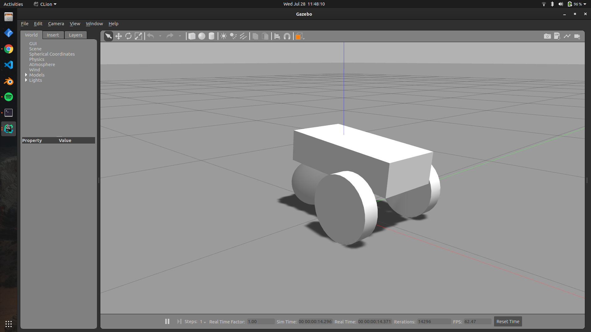
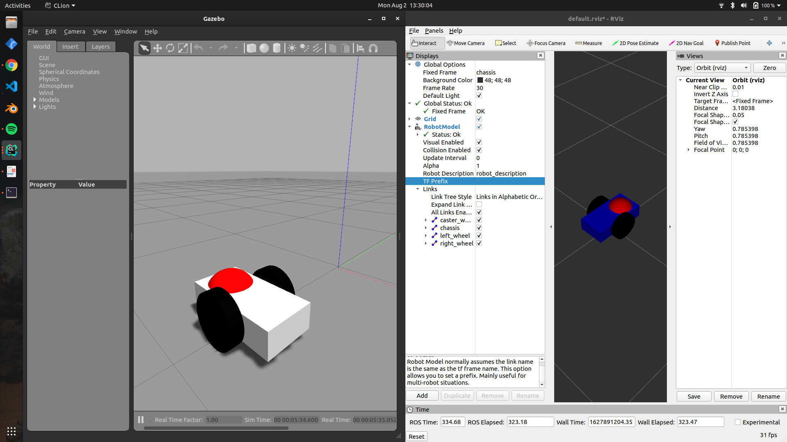

# ROSJECTS DESCRIPTION
Always remember to source your **devel/setup.bash** file into **~/.bashrc**  
I had conflicting package names in ROSJect_2 mybot, which **roscd** could not find.  
Remember to always have different package names.
## ROSject_1

A basic ROSJect for a **Hello World** package
* Implements a Talker and a Listener node
* Adds a number of changes to the CMakeLists.txt of **hello_world** to accomodate a custom message file **num.msg**
* Due to auto CMake reload, a redundant **helloWorld** folder gets created, yet to remove it

## ROSject_2  

* Model colors spawn arbitrarily, could not affect this properly for some reason. 
* Controller added to the joints, needs two packages installed:
  * Robot State Publisher
  * Joint State Publisher
* URDF parsing can have issues. Check: mybot_controller.launch for more details.
* No Transform error can be [resolved](https://www.reddit.com/r/ROS/comments/e3u3ru/rviz_error_no_transform_from_wheel_left_link/f95lk3o?utm_source=share&utm_medium=web2x&context=3) through the two following node types depending on the kind of joints you have defined (non-exhaustive)
  * If your joints are "continuous", the controller launch file needs joint state publisher if you want to see the wheels physically rotate
  * If the joint type is "fixed", robot state publisher node in the controller launch file can do the trick
  * Check changelog of lines 9-17 of mybot_control.launch for context to the no transform problem

* The transmission syntax is different from past ROS versions
  * Both joint and actuator units require a **<hardware_interface>** tag
  * `**<hardwareInterface>hardware_interface/EffortJointInterface</hardwareInterface>**` is the way to put it for an effort joint
  * All controllers defined in config/mybot_control.yaml need to be mentioned in the controller manager/spawn node arguments
  * Install effort controllers for Noetic through `sudo apt get-install ros-noetic-effort-controllers`
  [The controller manager wiki](http://wiki.ros.org/controller_manager)
